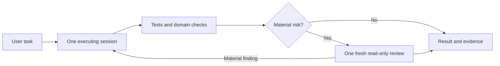

# Single-session execution

Version 2 replaces the per-task role graph with one owner: the current session.
The session understands, implements and verifies. Product, design, architecture,
science and debugging are capabilities applied through relevant context and
skills. They are not mandatory agent identities or sequential handoffs.

## Execution and review

The model handles planning, investigation, tool selection and ordinary
implementation choices. The runtime handles context, thread identity, follow-up,
completion and cancellation. There is no custom invocation ledger, admission
protocol, role-slot graph, read-claim token or mandatory trial enrollment.

Only three native profiles remain discoverable:

| Profile | Use |
|---|---|
| Praxys Orchestrator | Execute the task directly; existing sessions follow its instructions without launching it again. |
| Quality | One consolidated, independent review for material risks; fresh context and read-only. |
| Operations | Optional isolated adapter for separately authorized local operations tools. |

Routine reversible fixes, documentation and UI refinements require sufficient
tests and rendered checks without an extra agent. Science/formula changes,
security/privacy, architecture/external contracts, production/incident work,
agent policy and other material risks require independent review. UI skills and
scientific evidence requirements still apply. A specialized review can use all
relevant context without launching professional role agents.

For a genuinely complex task, an additional read-only investigation is useful
only when it can answer a bounded independent question or reduce wall time.
Only the main session dispatches. Serialize writes and dependent work; reuse
active threads, and do not replace an agent whose termination is unconfirmed.
A failed required reviewer leaves review incomplete and blocks the dependent
release/handoff; it does not prevent authorized local preparation.

## Authority and records

Use existing user authorization within its resource, action and risk scope.
Routine reversible decisions are agent-resolved. Ask only for missing authority
or a material choice that cannot be inferred, after preparing the concrete
result. Combine related questions. A review finding normally leads to a fix,
not another human approval request.

This changes session governance, not external authority. Scientific acceptance
and activation identities, immutable subjects, external tool consent, CI,
branch protection, merge and production controls remain binding. General task
authorization cannot substitute for a required digest-bound science approval.
No old approval receipt is transferred to this policy revision.

The task/PR record contains scope, material decisions, validation and remaining
risks. Reuse existing accepted decisions. Write an ADR or domain record only
when the durable choice or domain schema needs it. Ordinary UI work does not
need separate Product and Design decision files. Scientific Evidence Reviews
and SDRs remain schema-backed artifacts with their existing review gates.

## Configuration

`AGENTS.md` is the concise session entry point.
`config/agentic-operating-model.json` lists the workflow and context sources;
`config/agentic-task-routing.json` lists concerns requiring independent review.
The optional `scripts/route_agentic_task.py` summarizes a classification in one
record. Its digest binds the policy and output for comparison; it is not an
approval or admission token. Classification still requires reading the actual
task and diff, including causal deployment effects. A missing risk flag is not
proof that a change is safe.

`config/agent-loop-policies.json` keeps session-authority guidance alongside the
existing automated assignment/selective-merge policies. Those merge policies
are unchanged. `check_agent_runtime_parity.py` verifies native sandbox, tools,
credential filters, skill links and hooks; it does not measure runtime parity.

## Measure before claiming success

The structural change removes ten of thirteen registered profiles and replaces
seven mandatory loop types with one workflow. Ordinary work has zero mandatory
agent handoffs; risky work has one review round trip, absent findings. These
are configuration counts, not measured latency or quality results.

Compare representative tasks of similar complexity: elapsed start-to-completion
time including retries and waits, human approval requests, agent handoffs,
corrections/reopens/reverts, escaped defects, and missing required checks.
Use available session/CI records; do not add a per-task ledger or another review
agent merely to collect these numbers. Unknown measurements stay unknown.
Do not claim equal or better quality until outcome evidence supports it.

If required checks are missed or defects increase, restore targeted independent
review for that failure mode. Revert this policy change if the guardrails cannot
be met. Do not reactivate retired trials or reinterpret their old cohorts as
successful v2 observations. Git history retains the removed implementation;
private ledgers and historical approval documents remain untouched.
